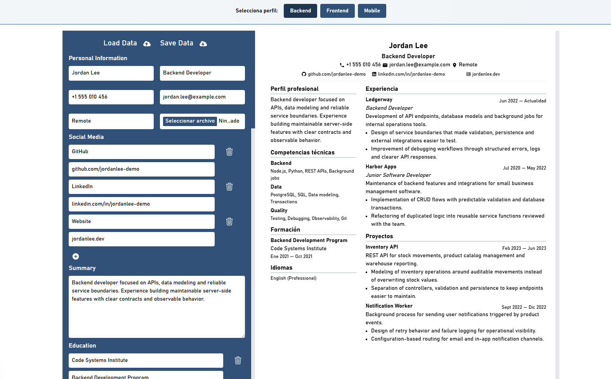

# ProfileStack

[English](README.md) · [Castellano](README.es.md)

One career story, many role-ready CVs.

<p align="center">
  
</p>

ProfileStack is an open source resume management system for maintaining multiple CV variants from structured profile data. It helps you keep your professional history organized, adapt it for different opportunities, and export clean one-page resumes without rewriting the same information over and over.

---

## The Problem

Most professionals do not really have one CV.

They have one career history that needs to be framed differently depending on the role, company, seniority level, industry, or hiring context. A developer may need a frontend CV, a backend CV, and a product-focused CV. A designer may need one version for UX research and another for product design. A marketer may want separate versions for content, growth, and brand roles.

Copying the same document again and again works for a while, but it quickly becomes hard to maintain. Dates drift, wording becomes inconsistent, strong projects get buried, and every update has to be repeated manually across files.

## The Solution

ProfileStack is not just another resume generator.

**ProfileStack is a resume management system.**

Instead of treating a CV as a single static document, ProfileStack treats each CV as a profile variant: a focused version of your professional story, stored as structured data and rendered through the same editor and preview.

You create one file per profile, such as `frontend.profile.js`, `backend.profile.js`, or `product-manager.profile.js`. ProfileStack discovers those files automatically, shows them in the selector, lets you edit and preview them, and keeps the final output ready for browser PDF export.

## Features

- **Multiple CV variants**  
  Maintain different CVs for different roles without duplicating application logic.

- **Automatic profile discovery**  
  Add a new `*.profile.js` file and it appears in the app.

- **One-page A4 layout**  
  Preview your CV in a print-oriented layout designed for concise resumes.

- **Browser PDF export**  
  Export through the browser print dialog using "Save as PDF".

- **ATS-friendly structure**  
  Keep content structured, readable, and compatible with automated screening tools.

- **Structured profile schema**  
  Store profile data as predictable JavaScript objects.

- **Private local profiles**  
  Keep real personal CVs out of Git with ignored private profile files.

- **Open source**  
  Clone it, customize it, and adapt it to your own career workflow.

## Who Is This For?

ProfileStack can be useful for anyone who applies to more than one type of role:

- Developers
- Designers
- Product Managers
- QA Engineers
- DevOps Engineers
- Data Analysts
- Marketing professionals
- Career changers
- Freelancers and consultants

It is especially useful when your experience is broad, but each application needs a sharper story.

## Architecture

```text
Profile
   |
   v
Resume Data
   |
   v
Editor
   |
   v
Preview
   |
   v
PDF
```

Profiles live as data files. The app loads them automatically, renders them in the editor, shows the A4 preview, and lets the browser handle PDF export.

## Installation

```bash
npm install
npm run dev
```

Open the local URL printed by Next.js, usually:

```text
http://localhost:3000
```

Useful scripts:

```bash
npm run dev
npm run build
npm run start
npm run lint
```

## Creating Profiles

Public demo profiles live in:

```text
src/data/profiles/
```

To create a new profile in less than five minutes:

1. Add a new file in `src/data/profiles/`.
2. Name it after the role or audience, for example:

```text
frontend.profile.js
backend.profile.js
product-manager.profile.js
qa-engineer.profile.js
marketing.profile.js
```

3. Export an object with this structure:

```javascript
export default {
  id: "frontend",
  label: "Frontend",
  description: "Frontend-focused CV for UI, components, and product interfaces.",
  resume: {
    name: "Alex Morgan",
    position: "Frontend Developer",
    contactInformation: "+1 555 010 123",
    email: "alex.morgan@example.com",
    address: "Remote",
    profilePicture: "",
    socialMedia: [],
    summary: "",
    education: [],
    workExperience: [],
    projects: [],
    skills: [],
    languages: [],
    certifications: []
  }
}
```

4. Refresh the app.

That is it. The profile selector is built from the metadata in your files, so you do not need to modify the application logic.

## Private Profiles

Real CVs often contain personal data. ProfileStack includes a simple strategy for keeping private profiles local.

Use this pattern for private profiles you want to load locally:

```text
src/data/profiles/my-real-cv.private.profile.js
```

Files matching this pattern are ignored by Git:

```text
*.private.profile.js
```

Because the file still lives inside `src/data/profiles/`, ProfileStack can discover it locally while Git keeps it out of the public repository.

You can also store private notes, drafts, or source material here:

```text
src/data/private-profiles/
```

That folder is ignored by Git and is intended for local material, not public demo profiles.

## Export to PDF

To export a CV:

1. Run the app with `npm run dev`.
2. Select the profile you want to export.
3. Review the A4 preview.
4. Click the print button.
5. Choose "Save as PDF" in your browser print dialog.

The export flow intentionally uses the browser. It keeps the project simple, avoids server-side document generation, and makes the result easy to inspect before saving.

## Philosophy

ProfileStack is built around a simple editorial idea:

> A CV should be written for a person, while remaining structured enough to pass automated filters.

The goal is not to fill a document with keywords. The goal is to make each version of your CV answer a clear question quickly:

- What kind of role is this person aiming for?
- What capabilities should I remember after reading it?
- What evidence makes this profile credible?

The same professional history can support different stories, as long as each version stays truthful, focused, and defensible in an interview.

## Roadmap

- [x] Multiple profile architecture
- [x] Automatic profile loading
- [x] Browser PDF export
- [ ] Custom layouts
- [ ] Theme customization
- [ ] Profile templates
- [ ] JSON schema validation
- [ ] Import from LinkedIn
- [ ] Export presets

## Contributing

Contributions are welcome.

Good first contributions include:

- Improving documentation.
- Adding profile examples.
- Refining the profile schema.
- Improving print styles.
- Fixing accessibility issues.
- Proposing layout or theme improvements.

Before opening a larger pull request, please open an issue or discussion explaining the change. ProfileStack should stay focused: structured profile management, clear CV variants, and practical export.

## Credits

ProfileStack is a fork of [ATSResume](https://github.com/sauravhathi/atsresume), originally created by [Saurav Hathi](https://github.com/sauravhathi).

This project keeps the original resume-builder foundation and evolves it into a system for managing multiple role-specific CV profiles from structured data.

## License

MIT. See [LICENSE.md](./LICENSE.md).
